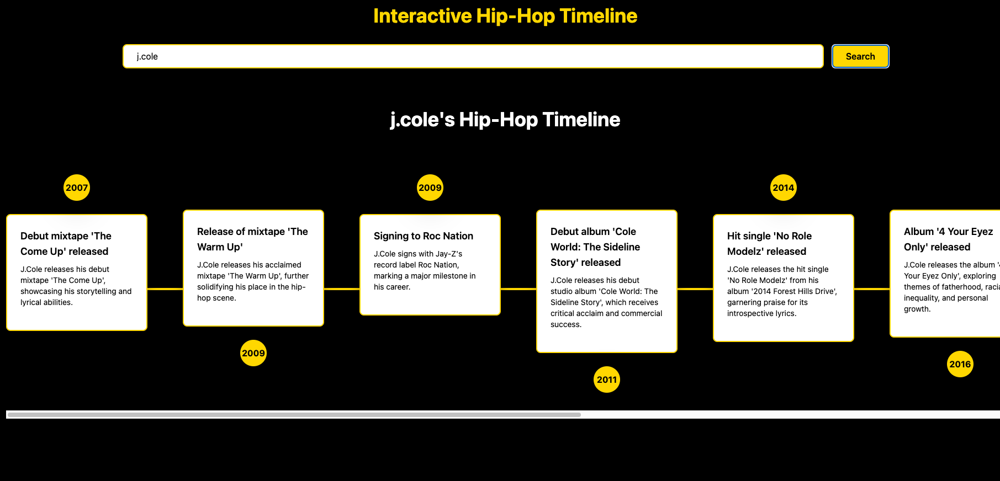

🎤 Interactive Hip-Hop Timeline 🏆

An AI-powered timeline that showcases major events in hip-hop history. Users can search for an artist, and the timeline dynamically displays their albums, awards, and iconic moments using GPT-3.5.

📌 Table of Contents

Features

Screenshots

Tech Stack

Installation

1️⃣ Backend Setup (FastAPI & Python)

2️⃣ Frontend Setup (React)

3️⃣ Running the Application

Environment Variables

Database Setup (Optional)

Deployment

Future Enhancements

Contributing

License

🎨 Features

✅ Dynamic Artist Search – Search any hip-hop artist and see their career highlights.✅ AI-Powered Timeline – Uses GPT-3.5 to generate event descriptions dynamically.✅ Sleek UI – Tailwind-styled timeline with smooth animations.✅ FastAPI Backend – Python-based backend to handle API requests.✅ React Frontend – A responsive UI built with React.✅ Deployed & Scalable – Ready for hosting with Render & Vercel.

📸 Screenshots

🎯 Add screenshots here to showcase:

The homepage

Search results with a populated timeline

API response examples 